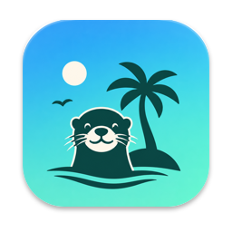

<div align="center">



# OtterIsland

**L'encoche de ton MacBook devient une île vivante** : presse-papier, captures, moniteur système,
mode présentateur, agenda, musique… et une petite loutre de compagnie.

[](https://github.com/RoYaL63/OtterIsland/releases/latest)

[](LICENSE)

### [⬇️ Télécharger OtterIsland.dmg](https://github.com/RoYaL63/OtterIsland/releases/latest/download/OtterIsland.dmg)

<sub>Gratuit et open source · macOS 14 ou plus récent · Mac à encoche ou non</sub>

<sub>macOS bloque le premier lancement ? C'est normal, l'app n'est pas notarisée : <a href="#installer">débloquez-la une fois</a>, sans Terminal ni mot de passe admin.</sub>

</div>

---

## Communauté et soutien

🦦 **Rejoignez-moi sur la [communauté Cube](https://ressources.cube.fr/l/j4nb7bn)** pour échanger ou co-construire des apps.

💛 **Soutenez-moi en utilisant mes liens de parrainage :**

- [Hostinger](https://hostinger.fr?REFERRALCODE=5QYMAILLEWXJ)
- [Lovable](https://lovable.dev/invite/265ZPB4)
- [Dreamflow](https://dreamflow.app/?grsf=augustin-0dlzrd)
- [Wispr Flow](https://wisprflow.ai/r?AUGUSTIN29)
- [Comet (Perplexity)](https://www.perplexity.ai/browser/invite-ga)
- [École Cube](https://ressources.cube.fr/l/myd27c7)
- [Proton](https://pr.tn/ref/6YCJEFG7)

---

## Sommaire

- [Installer](#installer)
- [Fonctionnalités](#fonctionnalités)
  - [L'île](#lîle) · [La loutre de compagnie](#la-loutre-de-compagnie) · [Presse-papier](#presse-papier) · [Captures d'écran](#captures-décran) · [Moniteur](#moniteur)
  - [Live — mode présentateur](#live--mode-présentateur) · [Nettoyage du clavier](#nettoyage-du-clavier)
  - [Agenda, musique, étagère, miroir, Pomodoro](#agenda-musique-étagère-miroir-pomodoro) · [Assistants IA](#assistants-ia--claude-code-et-codex)
- [Autorisations macOS](#autorisations-macos)
- [Confidentialité : clés, comptes, données personnelles](#confidentialité--clés-comptes-données-personnelles)
- [Mettre à jour · désinstaller](#mettre-à-jour--désinstaller)
- [Compiler, forker, contribuer](#compiler-forker-contribuer)
- [Communauté et soutien](#communauté-et-soutien)

---

## Installer

1. **Télécharger** : récupérez [OtterIsland.dmg](https://github.com/RoYaL63/OtterIsland/releases/latest/download/OtterIsland.dmg), ouvrez-le et glissez la loutre sur le dossier **Applications**.
2. **Lancer** : ouvrez OtterIsland depuis Applications. Si vous la lancez depuis ailleurs (Téléchargements, l'image disque), elle propose de s'installer toute seule dans Applications.
3. **Débloquer l'app, une seule fois** : elle n'est pas notarisée par Apple, donc macOS affiche « Élément "OtterIsland" non ouvert ».
   - Cliquez sur **Terminé** (surtout pas *Placer dans la corbeille*).
   - Allez dans **Réglages Système › Confidentialité et sécurité** et descendez jusqu'à la section *Sécurité*.
   - À côté de « L'ouverture de "OtterIsland" a été bloquée », cliquez sur **Ouvrir quand même**, validez avec Touch ID ou votre mot de passe, puis cliquez sur **Ouvrir**.
   - Pour les adeptes du Terminal, une ligne suffit : `xattr -dr com.apple.quarantine /Applications/OtterIsland.app`
4. **C'est parti** : la loutre vit dans l'encoche et dans la barre des menus (🦦), sans icône dans le Dock. Survolez l'encoche pour ouvrir l'île.
5. **Autorisations, au fil de l'eau** : l'app ne demande un accès que quand une fonction en a besoin, et tous sont facultatifs. Ils se règlent dans Réglages Système › Confidentialité et sécurité :
   - **Accessibilité** : coller depuis l'historique du presse-papier, masquer les clés pendant le Live, afficher les touches.
   - **Surveillance des saisies** : verrouiller le clavier pour le nettoyer.
   - **Calendriers / Rappels** : agenda et prochain rendez-vous.
   - **Caméra** : le miroir.
   - **Automatisation** : piloter Spotify ou Musique.
   - Rien d'autre : pas d'enregistrement de l'écran, pas de micro, pas de localisation.
6. **Mises à jour** : Réglages de l'app › Mise à jour › **Installer et redémarrer**. Le déblocage de l'étape 3 n'est plus à refaire.

Le code est sous licence MIT : forks, idées et retours bienvenus, ici ou dans les [issues GitHub](https://github.com/RoYaL63/OtterIsland/issues). Je suis preneur de tous vos retours, surtout sur le mode Live si vous faites des démos ou des formations.

---

## Fonctionnalités

### L'île

- **Au survol**, l'encoche s'ouvre en carte : accueil (batterie, mémoire, prochain rendez-vous, Pomodoro), presse-papier, captures, moniteur, musique, agenda, étagère, miroir.
- **Pas d'ouverture intempestive** : il faut que le pointeur s'**arrête** sur l'encoche (délai réglable). Traverser la zone pour cliquer un onglet de navigateur n'ouvre rien.
- **Molette** au-dessus de l'encoche pour ouvrir ou fermer.
- **HUD de volume** dans l'encoche (désactivable : macOS affiche déjà le sien).
- **Tout se règle** dans Réglages › Fonctionnalités : onglets affichés et leur ordre, éléments de l'accueil (Pomodoro, RAM, calendrier…), options de l'onglet Musique.
- **Plusieurs écrans** : dans **Réglages › Encoche**, choisis où vit l'île — un écran fixe (celui du MacBook par défaut), l'écran sous le pointeur, ou tous les écrans. Sur un écran sans encoche, elle se replie en un petit onglet 🦦 au milieu de la barre des menus : survole-le ou clique-le pour l'ouvrir.
- **Loutre de compagnie** en option : voir [ci-dessous](#la-loutre-de-compagnie).
- Design Liquid Glass, réglages fins de taille et de position par écran. **Apparence** (Réglages › Apparence) : style OtterIsland, style **Système** qui suit le mode clair / sombre, le Liquid Glass transparent / teinté et la couleur du thème de macOS, ou Personnalisé : couleur d'accentuation (dont celle du système), teinte et opacité du verre, Liquid Glass / verre dépoli / opaque, contraste du texte — avec aperçu en direct.

### La loutre de compagnie

Une petite loutre en pixel-art qui réagit à ce qui se passe sur ton Mac. **Désactivée par défaut** : active-la dans **Réglages › Général › Loutre de compagnie** (menu 🦦 de la barre des menus).

Une fois activée, elle se loge en version compacte dans la rangée des onglets de l'île, à gauche du bouton Live, sans prendre de place au contenu. Son animation suit ton contexte :

| Elle… | Quand… |
|---|---|
| joue | tu ouvres l'île |
| nage | de la musique joue (Spotify, Musique) |
| est contente | le Mac est en charge |
| met son casque | un Pomodoro est en cours |
| regarde l'heure | un rendez-vous commence dans moins de 5 min |
| est curieuse | Claude Code attend ta réponse |
| s'inquiète et se planque | la batterie est faible ou la mémoire sature |
| passe un chiffon | le clavier est verrouillé pour le nettoyage |
| s'endort, puis bâille sous la lune | tu es inactif, ou il fait nuit |

Et elle réagit sur le moment : coquillage lancé quand tu approuves une action Claude Code, flash à chaque capture d'écran, fichier attrapé au vol sur l'étagère, étirement de soulagement à la fin d'un Pomodoro. Elle s'efface pendant le Live.

### Presse-papier

- **⌥V** (modifiable) depuis n'importe quel champ de texte : l'historique s'ouvre, un clic colle l'élément là où tu étais.
- Texte, images et captures d'écran ; 30 derniers éléments.
- **Les mots de passe copiés depuis un gestionnaire** (1Password, Bitwarden, Trousseau…) **ne sont jamais enregistrés.**

### Captures d'écran

- Après ⌘⇧4, une **notification cliquable** apparaît en bas à droite : un clic ouvre la capture dans **Aperçu** pour l'annoter, glisser la dépose ailleurs.
- La capture part **directement dans le presse-papier** : ⌘⇧4 puis ⌘V.
- Onglet **Captures** : la dernière en grand, les précédentes en bande.
- Un interrupteur coupe la vignette flottante de macOS, qui retarde la capture d'environ 5 secondes.

### Moniteur

- **Un verdict en une ligne** : « Tout va bien », « Redémarrage conseillé », « Fais de la place sur le disque »… et pour chaque constat, sa cause et l'action en un clic.
- **Mémoire détaillée** : apps, système, compressée, cache, libre, swap — avec ce que chaque part veut dire.
- **Chaleur** : température de la puce et ventilateurs (lus dans le SMC), charge sur 1/5/15 min, qui fait chauffer.
- **Applications** regroupées (les 30 processus de Chrome comptent comme une app), processus système expliqués (Spotlight qui indexe, iCloud qui synchronise…), quitter ou forcer l'arrêt.
- **Historique sur 14 jours** : les apps — et les pages web — qui ralentissent ton Mac **régulièrement**.
- **Rapport Markdown** exportable.

### Live — mode présentateur

Bouton **● Live** dans l'île, ou **⌃⌥L**. Le témoin ● apparaît sur la loutre de la barre des menus, et l'île devient une barre d'outils qui s'ouvre au survol.

| | |
|---|---|
| **Dessiner** | Stylo, flèche, rectangle, cercle, surligneur, laser. Les traits **s'estompent** après 3 à 20 s (ou restent). Une flèche ou un cercle tracés à main levée sont **redressés**. Maintenir **⌃** et glisser : trait rapide sans choisir d'outil. |
| **Pastilles numérotées** | Chaque clic pose ①, ②, ③… ; tape aussitôt une **étiquette** (↩ pour valider), ou reclique ailleurs pour la pastille seule. |
| **Curseur** | Anneau fin, **comète**, **étincelles** ou **pointillés** ; animation différente au clic gauche, au double-clic et au clic droit ; projecteur qui assombrit tout sauf autour du curseur. |
| **Touches affichées** | Les raccourcis tapés (⌘C, ⌘⇧4…) s'affichent en bas de l'écran — **jamais le texte tapé**. |
| **Masquage** | Les **clés API et mots de passe visibles** sont recouverts (OpenAI, Anthropic, Stripe, GitHub, AWS, Google, Slack, Airtable, Notion, jetons JWT, webhooks Make, en-têtes `Authorization: Bearer …`, `?key=` dans les URL…). Les apps sensibles (1Password, Trousseau, Messages…) sont cachées entières. |
| **Bureau caché** | Les icônes du bureau disparaissent derrière ton fond d'écran ; option pour masquer les autres apps. |
| **Concentration** | Coupe les notifications pendant le Live (via tes raccourcis Concentration). |
| **Personnaliser** | Palette et sélecteur de couleurs avec codes hexa, effets, tailles, apps à masquer, **raccourcis configurables**. |

> **Partage l'écran entier**, pas une seule fenêtre : sinon les participants ne voient ni les dessins ni les masques.
> Le Live ne capture **aucun** raccourci des apps (⌘Z, ⌘V, Échap continuent de marcher partout) et reste sous 2 % de processeur.

### Nettoyage du clavier

Un bouton de l'accueil **verrouille tout le clavier** le temps de le nettoyer : aucune touche ne déclenche quoi que ce soit. Un clic dans l'île le déverrouille — jamais une touche, puisqu'elles sont bloquées.

### Agenda, musique, étagère, miroir, Pomodoro

- **Agenda** : évènements des prochaines 24 h et rappels, à cocher depuis l'île.
- **Musique** : titre, pochette, progression et contrôles pour **Spotify** et **Apple Music**, volume et coupure du son, bouton pour ouvrir le lecteur (ou le lancer quand rien ne joue).
- **Étagère** : glisse des fichiers sur l'encoche pour les garder sous la main, envoi **AirDrop**.
- **Miroir** : la caméra, pour vérifier sa tête avant une visio. Choix de la caméra (intégrée, USB, iPhone), image en miroir ou telle que les autres te verront, cadrage plein ou complet. **Fond et effets…** ouvre le miroir en grand avec les effets vidéo de macOS — arrière-plan, mode Portrait, Lumière studio, Cadre centré — pour te préparer.
- **Pomodoro** avec mode Concentration, pause de la musique et carillon.

### Assistants IA : Claude Code et Codex

Dans **Réglages › Assistants IA**, choisis les assistants à suivre :

- **Tokens** de la journée et de la session en cours, projet actif : un onglet **Assistants IA** apparaît dans l'île. Lu dans les journaux de session sur ce Mac (`~/.claude/projects`, `~/.codex/sessions`), rien n'est envoyé nulle part.
- **Demandes dans l'île** : « Claude veut utiliser Bash », « Claude attend ta réponse », « Codex a terminé » s'affichent dans l'île et la loutre lève la tête. Pour Claude Code, un clic sur **Brancher** ajoute le hook nécessaire (avec copie de sauvegarde de `~/.claude/settings.json`) ; pour Codex, une ligne à coller dans `~/.codex/config.toml`.

Le suivi de Codex est écrit d'après sa documentation, sans avoir pu l'essayer. L'app ChatGPT ne laisse rien de lisible sur le Mac : elle ne peut pas être suivie.

Pour tes propres scripts, l'**inbox par dossier** reste disponible : voir [docs/CLAUDE_CODE.md](docs/CLAUDE_CODE.md).

## Autorisations macOS

OtterIsland ne demande une autorisation **qu'au moment où une fonction en a besoin**. Toutes sont facultatives : sans elles, la fonction concernée est simplement indisponible. La page **Réglages › Autorisations** montre l'état de chacune et ouvre directement le bon panneau des Réglages Système.

| Autorisation | Pourquoi | Fonctions concernées | Où l'activer |
|---|---|---|---|
| **Accessibilité** | Simuler ⌘V, lire le texte affiché et les titres de fenêtres | Collage depuis le presse-papier, masquage des clés pendant le Live, touches affichées, titres de pages dans le Moniteur | Réglages Système › Confidentialité et sécurité › Accessibilité |
| **Surveillance des saisies** (avec l'Accessibilité) | Bloquer le clavier | Nettoyage du clavier | … › Surveillance des saisies |
| **Calendriers** et **Rappels** | Lire tes évènements et rappels | Agenda, prochain rendez-vous de l'accueil | … › Calendriers / Rappels |
| **Caméra** | Afficher l'image de la caméra | Miroir | … › Caméra |
| **Automatisation** (Spotify, Musique, System Events) | Lire le morceau en cours, piloter la lecture, demander un redémarrage | Musique, bouton « Redémarrer » du Moniteur | … › Automatisation |
| **Ouverture au démarrage** | Se lancer à l'ouverture de session | Réglages › Général | Réglages Système › Général › Ouverture |

**Aucune autre autorisation** : pas d'enregistrement de l'écran, pas de micro, pas de localisation, pas de contacts.

> Après une mise à jour, macOS peut décocher une autorisation si l'app n'est pas signée avec une identité stable : décoche puis recoche-la. Les builds officielles sont signées pour l'éviter ([docs/SIGNING.md](docs/SIGNING.md)).

---

## Confidentialité : clés, comptes, données personnelles

**OtterIsland n'a besoin d'aucun compte, d'aucune clé API, d'aucun identifiant.** Rien n'est à configurer, rien n'est envoyé à un serveur d'OtterIsland — il n'y en a pas.

**Ce qui sort du Mac — uniquement :**

- **Recherche de mise à jour** : une requête à l'API publique GitHub (`api.github.com/repos/RoYaL63/OtterIsland/releases/latest`), au lancement si l'option est cochée, et le téléchargement de la mise à jour quand tu l'installes.
- **Pochette d'album** : téléchargée depuis l'adresse fournie par Spotify, pour l'afficher.

**Ce qui reste sur le Mac**, dans `~/Library/Application Support/OtterIsland/` :

| Fichier | Contenu | Pour l'effacer |
|---|---|---|
| `clipboard.json` | Les 30 derniers éléments copiés (hors mots de passe des gestionnaires) | Presse-papier › Vider |
| `screenshots.json` | Chemins des 40 dernières captures | Captures › Vider |
| `shelf.json` | Chemins des fichiers posés sur l'étagère | Étagère |
| `usage-history.json` | Consommation des apps sur 14 jours, et titres des pages web lors des emballements du navigateur | Moniteur › Historique › Effacer (désactivable) |

Les réglages sont dans les préférences macOS (`com.otterwise.otterisland`). **Aucun mot de passe, aucune clé, aucun jeton n'est stocké.** Le masquage du Live lit le texte à l'écran pour le recouvrir, sans jamais l'enregistrer.

---

## Mettre à jour · désinstaller

**Mettre à jour** : Réglages › Mise à jour › **Installer et redémarrer**. L'app se remplace elle-même, sans zip ni nouveau passage par Gatekeeper.

**Désinstaller** : quitte OtterIsland (menu 🦦 › Quitter), mets l'app à la corbeille, puis supprime si tu veux ses données :

```bash
rm -rf ~/Library/Application\ Support/OtterIsland ~/.otterisland
defaults delete com.otterwise.otterisland
```

---

## Compiler, forker, contribuer

```bash
git clone https://github.com/RoYaL63/OtterIsland.git
cd OtterIsland
brew install xcodegen
xcodegen generate        # génère OtterIsland.xcodeproj depuis project.yml
open OtterIsland.xcodeproj
```

Dans Xcode : target **OtterIsland** › Signing & Capabilities › ton équipe (ou « Sign to Run Locally »), puis ⌘R. macOS 14+ et Xcode 16 requis.

**Pour publier ton propre fork** :

1. Remplace `owner` / `repo` dans `Sources/OtterIsland/Features/Update/Updater.swift` — sinon ton app proposera les mises à jour de ce dépôt.
2. Change l'identifiant `com.otterwise.otterisland` dans `project.yml` (`bundleIdPrefix` et `PRODUCT_BUNDLE_IDENTIFIER`).
3. Publie une version : onglet **Actions › Release › Run workflow** avec le numéro de version (celui de `MARKETING_VERSION` dans `project.yml`). La signature stable est facultative : [docs/SIGNING.md](docs/SIGNING.md).

**Pour aller plus loin** : architecture dans [docs/ARCHITECTURE.md](docs/ARCHITECTURE.md), pistes dans [docs/ROADMAP.md](docs/ROADMAP.md). Les PR sont bienvenues.

<sub>Licence [MIT](LICENSE) © 2026 Otterwise Solutions — fais-en ce que tu veux, en gardant la mention de licence. 🦦</sub>
